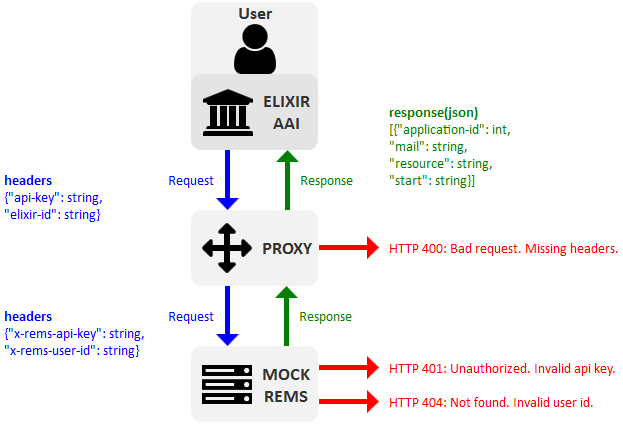

## ELIXIR AAI to REMS Proxy


This repository contains a proxy web server for calling a mock REMS API. The Mock API can also be substituted with an actual REMS API.



Fig. 1: Proxy service overview.

#### Contents
* [proxy](proxy) - proxy service that serves as a bridge between ELIXIR AAI and REMS API.
* [mock rems](mock) - web server that mocks REMS API for testing and demonstrating purposes.

### Run apps

Note: **Requires Python 3.6+**

Start the proxy server.
```
python3 proxy/proxy.py
```
Start the mock REMS API.
```
python3 mock/mockrems.py
```
Request data from the REMS API via the Proxy.
```
curl -H "api-key: abc123" -H "elixir-id: userid@elixir-europe.org" localhost:5000/entitlements
```
What happens here?
* A request is sent to `proxy.py` served at `localhost:5000/entitlements`;
* `proxy.py` forwards the request to `mockrems.py` served at `localhost:3000/api/entitlements`;
* `mockrems.py` responds to the request originated from `proxy.py`;
* `proxy.py` delivers the response from `mockrems.py` back to the user;
* [Video demo](https://puu.sh/BiSMr/ffeb09a9de.mp4) of the workflow in Figure 1.

### Run the proxy against the actual REMS API

Install and set up a local REMS instance to be called upon from the proxy service;
* Follow the REMS installation instructions [here](https://github.com/CSCfi/rems);
* Upon finishing the backend installation, populate the database with test data using `lein run test-data`;
* The REMS API is served by default at `localhost:3000`;
* Make sure the `REMS_API_URL` environment variable is set to `localhost:3000/api/entitlements`, it should default to this value if no value is given;
* [Video demo](https://puu.sh/BiVts/23c789131d.mp4) of this case.

Next you may call the Proxy, which delivers the request to the REMS API.

**ISSUE:** REMS is _currently_ not supporting the desired feature of user requesting their own entitlements. What this means, is that the example `curl` below doesn't work.
```
curl -H "api-key: 42" -H "elixir-id: alice" localhost:5000/entitlements
```
^Using the test data `api-key: 42` and `elixir-id: alice`.

Instead a developer `user-id` should be used, with the desired `user` defined in query parameters.
```
curl -H "api-key: 42" -H "elixir-id: developer" localhost:5000/entitlements?user=alice
```
^Using the test data `api-key: 42`, `elixir-id: developer`, `?user=alice` that were generated with `lein run test-data`.

### Environment Variables
The following environment variables are used to configure `proxy.py`.

| ENV | Default | Description |
| --- | --- | --- |
| `REMS_API_URL` | `http://localhost:3000/api/entitlements` | REMS API endpoint for entitlements. Same for `mockrems.py` and actual REMS API |
| `HTTPS_ONLY` | `False` | If set to `True` will only allow requests to `https://` is `False` for testing. |
| `APP_HOST` | `localhost` | Hostname for Proxy service. |
| `APP_PORT` | `5000` | Port for Proxy service. |

The following environment variables are used to configure `mockrems.py`.

| ENV | Default | Description |
| --- | --- | --- |
| `REMS_API_KEY` | `abc123` | Required API key. Invalid key in headers results in HTTP 401. |
| `REMS_USER_ID` | `userid@elixir-europe.org` | Required user ID. Invalid user ID in headers results in HTTP 404. |
| `APP_HOST` | `localhost` | Hostname for Proxy service. |
| `APP_PORT` | `3000` | Port for Proxy service. |
| `APP_DEBUG` | `True` | Enables debug logs in terminal. |
